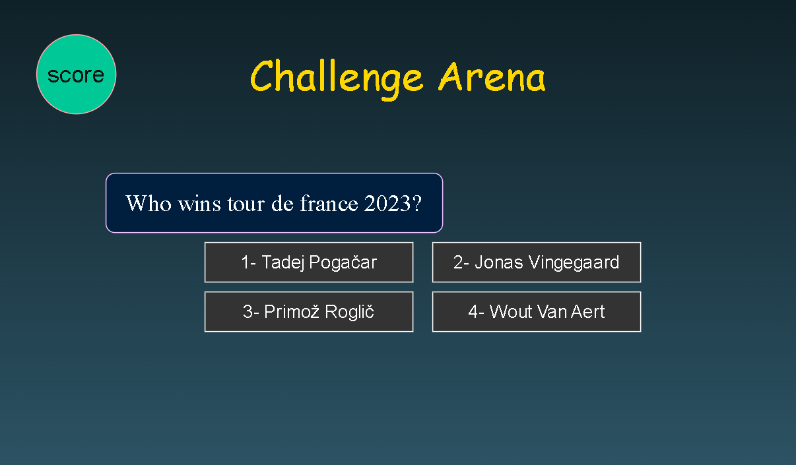

# Challenge Arena

## Game page

## Description
__Challenge Arena__ is a multiple-choice quiz game where the player is presented with 20 questions, each offering four possible answer choices. The player selects an answer by clicking on it, and the game immediately reacts—displaying feedback such as “The correct answer is…”—before automatically moving to the next question. At the end of the game, a final score is displayed, including the overall __total score__ as well as the __score for each category__.

## Features
- The game includes 20 multiple-choice questions divided into the following four categories:
   - 🏟️ Sports
   - 🗺️ Capital Cities
   - 💻 Technology
   - 🧠 Logic & Riddles
- The player can choose the difficulty level
- A Start button to begin the game
- Each question have a time to solve depend on the difficulty level
- Immediate feedback after each answer
- Score tracking throughout the game
- A final score screen showing both total and per-category results
- A Reset button to replay the game
## How to play
- Select difficulty level by clicking on the button, after clicking on it it will change to purple
- Click on start button
- One question will apper with 4 four possible answer choices
- For each question there is a time to solve it depend on difficulty level
  -60 seconds for Easy
  -40 seconds for Medium
  -30 seconds for Hard
- If the player didnt select difficulty level it will be easy as defult
- After select on of the answer, if the answer is true it will change it color to green, if wrong it will change to red
- After one second the next question will apper
- when the questions completed, "Chellenge completed!" message will apper
- To see the score, click "Score" button
- In the score page if want to go to start page, click "Home page" button
- To restart the challenge in the game page click "Reset" button"
