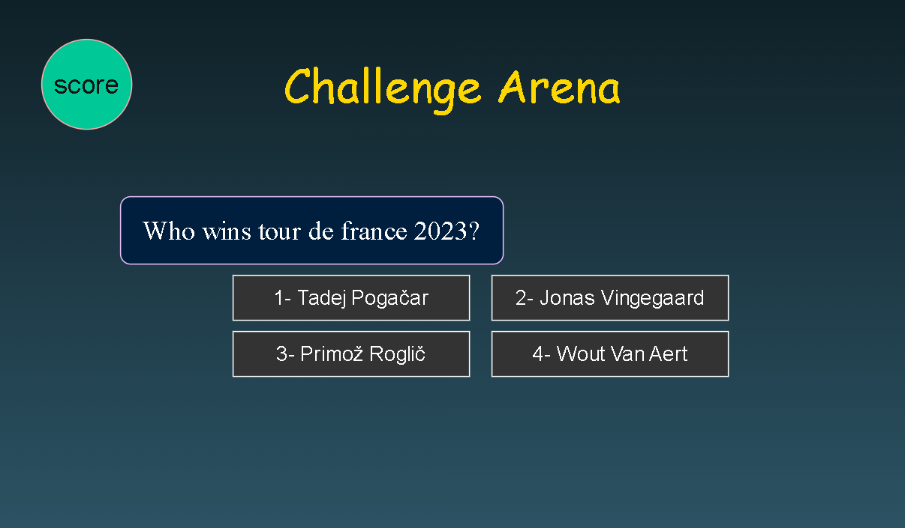

# Challenge Arena

## Game page

## Description
__Challenge Arena__ is a multiple-choice quiz game where the player is presented with 20 questions, each offering four possible answer choices. The player selects an answer by clicking on it, and the game immediately reacts—displaying feedback such as “The correct answer is…”—before automatically moving to the next question. At the end of the game, a final score is displayed, including the overall __total score__ as well as the __score for each category__.

## Features
- The game includes 20 multiple-choice questions divided into the following four categories:
   - 🏟️ Sports
   - 🗺️ Capital Cities
   - 💻 Technology
   - 🧠 Logic & Riddles
- A Start button to begin the game
- A 60-second timer for each question
- Immediate feedback after each answer
- Score tracking throughout the game
- A final score screen showing both total and per-category results
- A Reset button to replay the game

