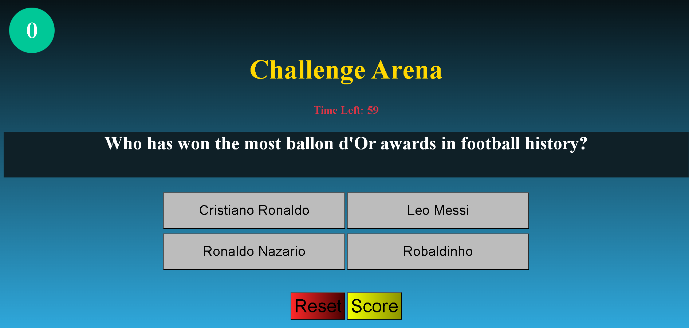

# Challenge Arena

## Description
**Challenge Arena** is a multiple-choice quiz game where the player is presented with 20 questions, each offering four possible answer choices. The player selects an answer by clicking on it, and the game immediately responds by changing the color of the selected answer **green for correct** and **red for incorrect**, before automatically moving to the next question. At the end of the game, a final score is displayed, including the overall **total score** as well as the **score for each category.**

## 🔗 Try It Out
👉 [Challenge Arena](https://challenge-arena.surge.sh/index.html)

## Features
- The game includes 20 multiple-choice questions divided into the following four categories:
   - 🏟️ Sports
   - 🗺️ Capital Cities
   - 💻 Technology
   - 🧠 Logic & Riddles
- The player can choose the difficulty level
- A Start button to begin the game
- Each question have a time to solve depend on the difficulty level
- Immediate feedback after each answer
- Score tracking throughout the game
- A final score screen showing both total and per-category results
- A Reset button to replay the game
## How to play
- Select Difficulty
  - Choose your preferred difficulty by clicking a button:
    - 🟣 Purple = Selected
    - 💡 If no difficulty is chosen, Easy is selected by default
  - Difficulty affects the time limit per question:
    - 🟢 Easy – 60 seconds
    - 🟡 Medium – 40 seconds
    - 🔴 Hard – 30 seconds
- Start the Game
  - Click the Start button to begin the challenge.
- Answering Questions
  - One question will appear at a time, with 4 answer choices.
  - Click on your chosen answer:
    - ✅ Correct answer = turns green
    - ❌ Wrong answer = turns red
- After 1 second, the next question automatically appears.
- Finishing the Challenge
  - Once all questions are answered, a “Challenge Completed!” message will be shown.
- View Your Score
  - Click the Score button to see your results.
  - In the score page:
    - Click “Home Page” to go back to the start.
    - Click “Reset” (from the game page) to restart the challenge.

## 🚧 Initial Design

## 🎯 Actual Game Page
